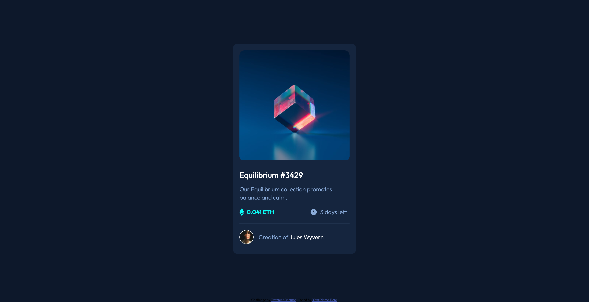
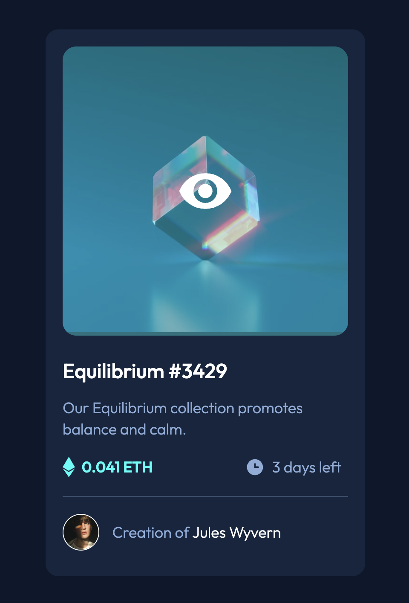
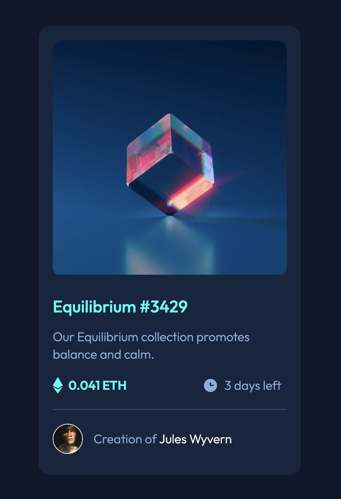
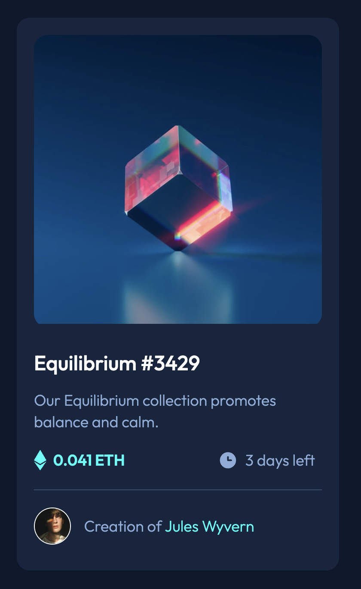
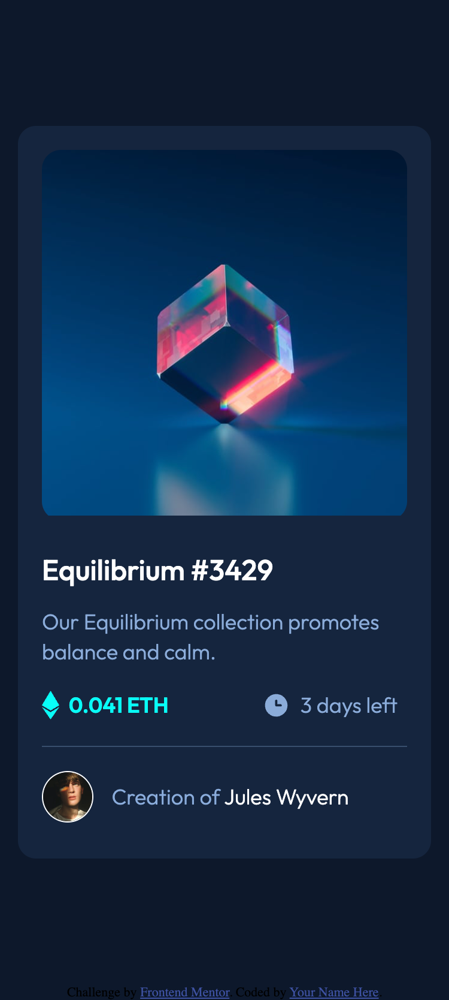

# Frontend Mentor - NFT preview card component solution

This is a solution to the [NFT preview card component challenge on Frontend Mentor](https://www.frontendmentor.io/challenges/nft-preview-card-component-SbdUL_w0U). Frontend Mentor challenges help you improve your coding skills by building realistic projects. 

## Table of contents

- [Overview](#overview)
  - [The challenge](#the-challenge)
  - [Screenshot](#screenshot)
  - [Links](#links)
- [My process](#my-process)
  - [Built with](#built-with)
  - [What I learned](#what-i-learned)
- [Author](#author)
- [Acknowledgments](#acknowledgments)

**Note: Delete this note and update the table of contents based on what sections you keep.**

## Overview

### The challenge

Users should be able to:

- View the optimal layout depending on their device's screen size
- See hover states for interactive elements

### Screenshot







### Links

- Solution URL: [GitHub](https://github.com/RaviBele/FrontEnd-NFT-Preview-Card)
- Live Site URL: [Netlify](https://steady-kitten-122f7d.netlify.app/)

## My process

### Built with

- Semantic HTML5 markup
- CSS custom properties
- Flexbox
- CSS Grid
- Mobile-first workflow
- CSS keyframes for animation


### What I learned

I learnt about how to use position absolute, z-index and css animations using keyframes

```css
.hover-image {
    position: absolute;
    top: 0;
    width: 100%;
    height: 100%;
    border-radius: 16px;
    overflow: hidden;
    background-color: hsla(178, 100%, 50%, 0.35);
    z-index: 1;
    display: none;
    justify-content: center;
    flex-direction: column;
    align-items: center;
}
```
```css
@keyframes popuop {
    0% {
        transform: scale(0) rotate(90deg);
        color: hsl(178, 100%, 50%);
    }
    100% {
        transform: scale(1);
    }
}
```

## Author

- Frontend Mentor - [@RaviBele](https://www.frontendmentor.io/profile/RaviBele)


## Acknowledgments

This is where you can give a hat tip to anyone who helped you out on this project. Perhaps you worked in a team or got some inspiration from someone else's solution. This is the perfect place to give them some credit.

